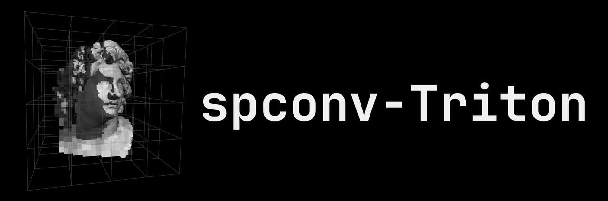

> [!NOTE]  
> 🚧 Pre-release: Feedback welcome!

<div align="center">

Nvidia: ❌ T4 (Turing) | ✅ A100 (Ampere) | ✅ RTX 3060 (Ampere) | ✅ H100 (Hopper) | ✅ L4 (Lovelace) | ✅ B200 (Blackwell)

AMD: ✅ MI300X

Tested with `torch 2.4 – 2.13`, `python 3.10 – 3.14`

</div>

## spconv-Triton

Spconv-Triton is a sparse convolution library with full operator support (Submanifold- and Dense-3D-Conv, Pooling, Transposed Convolution).
It runs on any GPU with support for Triton (NVIDIA, AMD, Intel, ...).

Spconv-Triton is designed as a plug-and-play replacement for [spconv 2.x](https://github.com/traveller59/spconv).

### Why

Various sparse convolution libraries exist, but with limited operators, hardware support, or maintenance.

[Spconv](https://github.com/traveller59/spconv) is the most widely adopted, fast and efficient.
However, its not maintained anymore and locks you into Nvidia hardware with older pytorch, python, CUDA.

Spconv uses Triton to bring sparse convolution to non-Nvida hardware.

### When

*Is spconv-Triton faster?* -> **Yes**. When running FP16 or TF32, SubM-Conv and Transposed-Conv (learned upsampling) is faster. Strided dense convolution (learned downsampling) is competetive.
See warm runtimes in [performance](#performance--memory).

Currently, this library is being developed. If you are looking for something battle-tested and have an NVIDIA GPU:

- spconv works → Keep spconv
- Other libraries and their operator set (Torchsparse++, FlexGEMM, etc.) fit your project? → Use them
- You are facing dependency / CUDA / support / hardware issues? → Try this library

> [!NOTE]
> spconv-Triton does not support box operations (e.g. NMS ops) of spconv-cuda.
> As many frameworks implement these themselves, these are not ported
>
> spconv-Triton also does not support CPU-only.

## Usage

**Checkpoints transfer from spconv**, no retraining!

Change one import.
Everything else stays the same:

```python
# import spconv.pytorch as spconv          # before
import spconv_triton.pytorch as spconv     # after

spconv.constants.SPCONV_ALLOW_TF32 = True # default: False, recommend True

# ... rest of your model/training code, unchanged

x = spconv.SparseConvTensor(features, indices_int32, spatial_shape, batch_size)
net = spconv.SparseSequential(
    spconv.SubMConv3d(3, 32, 3, padding=1, indice_key="s0"),
    spconv.SparseConv3d(32, 64, 3, stride=2, padding=1, indice_key="d0"),
    spconv.SparseInverseConv3d(64, 32, 3, indice_key="d0"),
)

net = torch.compile(net, fullgraph=False)  # Works with torch.compile!
out = net(x)
```

For available environment variables refer to the [docs](./docs/ENVIRONMENT_VARIABLES.md)

> [!NOTE]
> Install the torch build matching your hardware *first*.
> Only then `pip install spconv_triton`.
> Or use `UV_TORCH_BACKEND=auto` with uv
> This package explicitly doesnt declare Triton, as it ships with pytorch, but different hardware vendors have different triton-variants.

### Dtype Precision

Spconv-Triton inherits spconv's peculiarities about data types.

**fp16**: For fp16 inference, cast the model explicitly with `.half()`; under `torch.autocast` alone, sparse conv stays fp32 in eval mode (unlike dense `nn.Conv2d` behaviour).

**tf32**: Must be explicitly turned on via `spconv_triton.constants.SPCONV_ALLOW_TF32=True` (we inherit default = False). On some AMD hardware with `torch 2.7+`, TF32 needs `HIPBLASLT_ALLOW_TF32=1` set in the environment.

### Autotuning

It will take some time until kernels are autotuned and built.
Set a stable `TRITON_CACHE_DIR` (default `~/.triton/cache`) to persist
compiled kernels across processes → avoids re-paying the one-time compilation cost on every
fresh process. On Triton ≥ 3.3.0 the `triton.autotune` config sweep is persisted to
`TRITON_CACHE_DIR`. On older Triton that on-disk autotune cache is unavailable, so the sweep
re-runs on every fresh process.

> [!TIP]
> Ideally, choose torch versions with Triton ≥ 3.3.0.

**Distributed training (DDP)**: warm `TRITON_CACHE_DIR` with a short single-process run
before the first multi-rank launch. Otherwise every rank autotunes independently.

### Using with `torch.compile`

Spconv_triton runs eager and lets torch compile/fuse the dense parts of your model around them:

```python
import torch

# torch.compile is disabled inside the spconv_triton layers
model = torch.compile(model)   # BN / ReLU / residual adds on .features now fuse
```

**Why?**: Sparse convolution is data-dependent.
The number of features, neighborhoods and in some settings grid size change with input.
The sparse kernels are already written fused.
`torch.compile` treats them as opaque calls and will not fuse into them or make them faster.

-> In turn this means that `fullgraph=True` will fail.

## Testing

GPU required. The frozen suite runs against committed golden data and never needs reference spconv.
Each `tox` env pins one python/torch/runtime for AMD and Nvidia GPUs.
The `tox` matrix covers the support corners with a minimal set of envs. Python 3.10 (floor) / 3.12 / 3.14 (ceiling) paired with torch 2.4 (floor) / 2.8 / 2.13 (current).

Two env vars control the suite — `SPCONV_TEST_IMPL` (implementation under test) and `SPCONV_TEST_EXPECT_WARM` (warm-cache assertion) — documented in [environment variables](./docs/ENVIRONMENT_VARIABLES.md).

Quick test with current packages, reusing the existing triton cache:

```bash
uv run pytest tests/ -q -p no:cacheprovider
```

Full `tox` matrix, for CUDA/ROCm:

```bash
uvx --with tox-uv tox -m cuda
```

```bash
uvx --with tox-uv tox -m rocm
```

One combo, or a subset of the suite:

```bash
uvx --with tox-uv tox -e py310-torch24-cuda
uvx --with tox-uv tox -e py314-torch213-cuda -- -k test_conv
```

Cold/warm cache-persistence pair (newest CUDA row) runs the suite from a cleaned `TRITON_CACHE_DIR`.
Newly built cache is then reused for warm tests:

```bash
rm -rf ./.tox && uvx --with tox-uv tox -m warmcold
```

## Performance & memory

> [!NOTE]  
> More performance values coming soon

Relative runtime comparison between spconv-Triton, spconv, FlexGemm, warpconvnet, fVDB.
All warm started.
10 runs of 1000 iterations each.
Average / Std of medians reported.
Warpconvnet kernels natively default to TF32 under FP32 settings and as such are not included in that section.

Consumer hardware:

- [Nvidia RTX3060 (Ampere)](./docs/RTX3060/)

Server hardware:

- [Nvidia A100 (Ampere)](./docs/A100/)
- [Nvidia H100 (Hopper)](./docs/H100/)

Embedded hardware:

## Attribution

This project is derived from [spconv](https://github.com/traveller59/spconv), by Yan Yan and contributors, originally licensed under Apache License 2.0.
This work is also released under Apache License 2.0